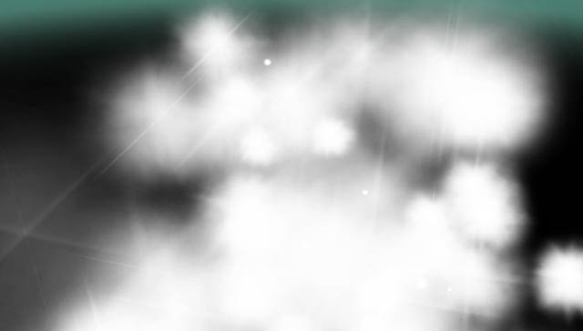
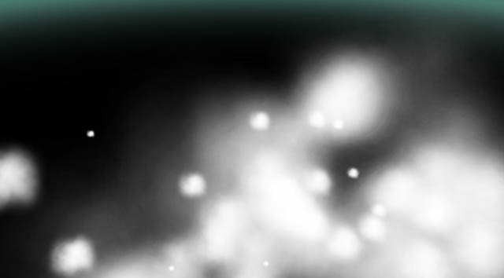
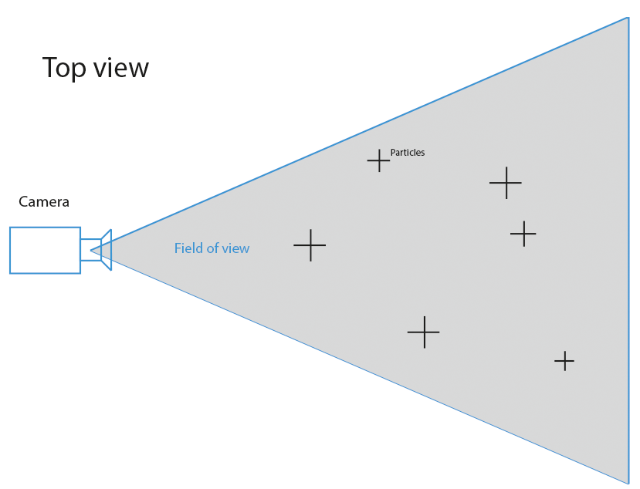
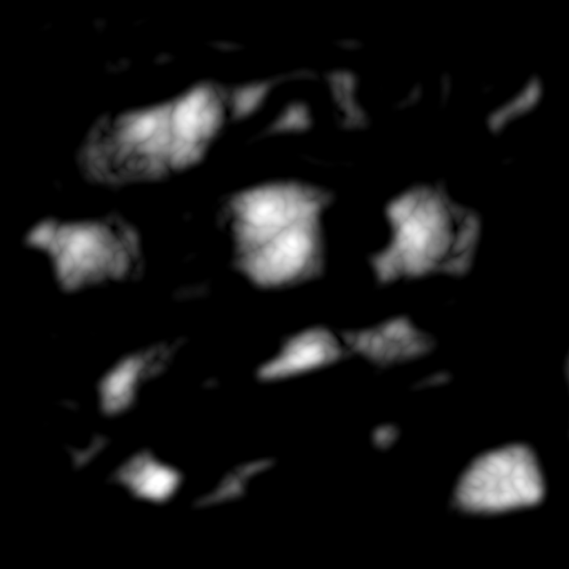

# Volumetric clouds - Fast billboards
## Avec HARFANG® 3D / Python
 Il y a plusieurs techniques de rendu pour les nuages:  
 * Raytracing  
 * RayMarching  
 * Voxels  
 * Billboards particls

 Le raymarching ou les voxels étant gourmands en ressources (pour la VR par exemple), la technique étudiée ici consiste à afficher des particules de billboards (textures 2D orientées vers la caméra).  
 
 Des shaders sont appliqués aux textures pour calculer l'éclairage et la base des nuages.
 
## Plans
 
 En fonction de la distance à la caméra, les billboards sont plus ou moins complexes. Au premier plan les particules nuageuses sont constitués non plus d'une texture à plat, mais de meshes composées de plusieurs plans entrecroisés.  
 Un shader permet d'éliminer l'effet de rasance peu élégant de ce genre d'objet:
 
 Avec rasance:
 
  
  
 Sans rasance:
 
  

## Champ de vision

Pour diminuer le nombre de particules à afficher, il est préférable de n'afficher que celle situées dans le champ de vision.  
Ce champ de vision est un triangle sur lequel il suffit de tapisser nos particules:

## Modélisation

Un simple positionnement des particules au hazard ne rend pas les nuages de manière satisfaisante.  
Pour savoir ou les placer et quelles tailles leur donner, il faut utiliser une texture de noise.

Par exemple:

